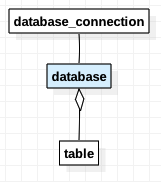

febs db库用于连接数据库,目前仅支持mysql

`febs-db是在citong-db@1.5.3基础上进行开发, citong-db库已停止更新`

- [Install](#install)
- [Exception](#exception)
- [1.Define Table](#define-table)
- [2.Connect db](#connect-db)
- [3.Manipulate db](#manipulate-db)
- [Class database](#database)
- [Class table](#table)

# Install

Use npm to install:

```js
npm install febs-db --save
```


 febs-db是一个orm库, 3个主要的类为:

> `database`: 代表一个数据库; 可以用于创建新的数据库连接对象`database-connection`进行事务等操作.

> `table`: 代表一个数据库表; 针对表的操作在这个对象中完成

> `database_connection`: 表示一个连接对象, 在执行事务操作时, 需要使用database来向连接池中获取一个连接来进行.


# Exception

在错误发生时会抛出`exception`类型的异常

事务处理中发生异常将自动rollback.

定义了常用的错误代码.

```js
// @desc: 数据查询条件错误。参数语句问题.
exception.DB_ERROR_SQL
// @desc: 数据连接问题.
exception.DB_ERROR_CONNECT
// @desc: 数据执行错误.
exception.DB_ERROR
```

异常类如下
```js
/**
* @desc: 构造异常对象.
* @param msg: 异常消息
* @param code: 异常代码
* @param filename: 异常文件名
* @param line: 异常文件所在行
* @return: 
*/
exception(msg, code, filename, line)
```
例子:
```js
var exception = require('.').exception;
try {
  yield db.queryById(...);
} catch (e) {
  if (e instanceof exception) {
    // e.code == exception.DB_ERROR_SQL, 查询语句错误.
  } else {
    throw e;
  }
}
```

# Define-table

操作一个数据表之前, 需要先对表结构进行定义, 与数据不匹配的定义在执行数据操作时会报错. 数据列可以仅列出需要操作的列.

```js
var table   = require('.').table;

class TableDemo extends table {
  constructor(db) {
    super(
      db,       // database
      'User',   // table name.
      'ID',     // primary key.
      {         // cols.
        ID:       {type: 'integer', size: 8, key: true}, // the auto-incrementing
        Name:     {type: 'text',    size:10},
        NumberCol:{type: 'number',  size: 4},
        IntCol:   {type: 'integer', size: 4},
        IntCol:   {type: 'integer', size: 8}, // big int.
        BoolCol:  {type: 'boolean'}
      }
    );
  }
}
```
## example:
```js
var database  = require('febs-db').database;

var db = new database({});
var tableDemo = new TableDemo(db);
```

## combined primary key

```js
var table   = require('.').table;

class TableDemo extends table {
  constructor(dbclient) {
    super(
      dbclient, // database
      'Admin',  // table name.
      ['ID', 'IntCol'],     // primary keys.
      {         // cols.
        ID:       {type: 'integer', size: 8, key: true},  // the auto-incrementing
        Name:     {type: 'text',    size:10},
        NumberCol:{type: 'number',  size: 4},
        IntCol:   {type: 'integer', size: 4},
        IntCol:   {type: 'integer', size: 8}, // big int.
        BoolCol:  {type: 'boolean'}
      }
    );
  }
}
```

# Connect-db

mysql: see [mysql](https://www.npmjs.com/package/mysql#pool-options) pool-options.

```js
var database = require('febs-db').database;

var opt = {
  waitForConnections: true,
  connectTimeout    : 5000,
  acquireTimeout    : 5000,
  queueLimit        : 20,
  connectionLimit   : 10,
  supportBigNumbers : true,
  bigNumberStrings  : false,  // number -> string only when number overflow in js.
  host              : '',
  port              : 3306,
  user              : '',
  password          : '',
  database          : '',
  /* ext */
  queryTimeout      : 5000,
};

var db = new database('mysql', opt);
var table = new TableDemo(db);
```

# Manipulate-db

数据操作方法都存在同步方式和异步方式, 例如: `table.isExist()` 和 `table.isExistSync()`
所有的同步方式方法都是在末尾加上`Sync`

- [exist](#exist)
- [query](#query)
- [query-Lock-Row](#query-lock-row)
- [count](#count)
- [add](#add)
- [update](#update)
- [remove](#remove)
- [transaction](#transaction)

## exist

```js
let r;
// async.
r = yield table.isExist(1);
r = yield table.isExist({ID:1,Name:'xxx'});    // combined primary key.
r = yield table.isExistWhere("id=43");
// sync.
r = yield table.isExistSync(1, (err, r)=>{});
r = yield table.isExistWhereSync("id=43", (err, r)=>{});
```

## query

```js
let r;
// 通过主键查询.
r = yield table.queryById(1);
r = yield table.queryById(1, ['ID','Name']);      // only query 'ID','Name' cols.
r = yield table.queryById({ID:1,IntCol:1}, ['ID','Name']);  // if combined primary key.

// top.
r = yield table.queryTop("id = 43");
r = yield table.queryTop("id = 43", ['ID','Name']);  // only query 'ID','Name' cols.

// 条件查询. 使用make_condition_xxx 方法构造条件, 能够自动检查数值类型.
let where = '';
where += table.make_condition('id', 43); // == " `id`=43 ".
where += 'AND';
where += table.make_condition_like('name', '%dfdfd%'); // == " `name` LIKE '%dfdfd%' ".
r = yield table.queryTop(where);

r = yield table.queryWhere(where, [0, 100], {ID:true});       // where id = 43 limit 0,100 order by id asc.
r = yield table.queryWhere(where, ['ID', 'Name']);            // only query 'ID','Name' cols.
r = yield table.queryWhere(where, [0, 100],  ['ID', 'Name']); // only query 'ID','Name' cols. limit 0,100
r = yield table.queryWhere(where, {ID:true}, ['ID', 'Name']); // only query 'ID','Name' cols. orderby ID
r = yield table.queryWhere(where, ['COUNT(ID) as x']);
```


## query-lock-row

锁行方式查询, 只能在事务中使用此方式. 在事务结束或update之后自动解锁.

`queryLockRow`方法的参数与`queryById`方法相同

```js
// 获取一个新连接用于事务执行.
var conn = yield db.getConnection();
if (conn)
{
  // 执行事务
  return yield conn.transaction(function*(){

    // lock row id = 1, and unlock after update or exit transaction.
    let r;
    r = yield table.queryLockRow(1, conn);
    // or.
    r = yield table.queryLockRow(1, ['col1','col2'], conn);

    return false; // will rollback.
    return true;  // will commit.
  });
}
```

## count

```js
let r;
let where = table.make_condition('id', 43); // == " `id`=43 ".
r = yield table.count(where);
```

## add

```js
var r = yield table.add({ID:8,...});
```

## update

更新方法需传入一个对象, 其中必须附带`主键`, 执行后将更新其他在参数中的其他数据.

```js
var mod = {
  ID:     1,
  name:   "name",
  intCol: table.make_update_inc(1),
  intCol2:table.make_origin_sql('`intCol2`+1')
};
var r = yield table.update(mod);  // ID=1,name="name",intCol=intCol+1,intCol2=intCol2+1
```

## remove

```js
var r = yield table.remove(where);
```

## transaction

* 执行事务需要一个独立的连接对象 `datdatabase_connection`, 事务完成后连接对象将重新被插入到连接池中.
* 事务处理函数中, 所有的事务数据库操作方法都必须在最后带上这个`连接对象`
* 事务处理函数中, 返回`false` 将`rollback`, 返回`true`将`commit`
* 若发生异常, 事务将自动`rollback`.
* *事务嵌套调用未处理, 将在下一版本添加

```js
// 获取一个新的连接用于事务执行.
var conn = yield db.getConnection();
if (conn)
{
  // 执行事务, 错误将返回false;
  return yield conn.transaction(function*(){
    // attach conn.
    console.log((yield table.add(mod, conn)));

    mod.id = 1;
    mod.name = 'a1';
    console.log((yield table.update(mod, conn)));

    return false; // will rollback.
    return true;  // will commit.
  });
}
```

# database

## 构造

```js
/*
* 构造
*/
constructor(dbtype, opt)
```
* dbtype: 数据库类型, 目前仅能为 `'mysql'`
* opt: 连接参数

mysql: see [mysql](https://www.npmjs.com/package/mysql#pool-options) pool-options.
```js
var opt = {
  waitForConnections: true,
  connectTimeout    : 5000,
  acquireTimeout    : 5000,
  queueLimit        : 20,
  connectionLimit   : 10,
  supportBigNumbers : true,
  bigNumberStrings  : false,  // number -> string only when number overflow in js.
  host              : '',
  port              : 3306,
  user              : '',
  password          : '',
  database          : '',
  /* ext */
  queryTimeout      : 5000,
};
```
## 获取连接

从连接池中获取一个空闲的连接用于事务处理.
```js
/**
  * @desc: get the connection for transaction.
  * @return: database_connection.
  */
*getConnection() // * 表明此方法是一个异步方法
```

# table

所有的数据库查询方法都存在相应的同步调用方式, 如: queryWhereSync();

- [constructor](#table-constructor)
- [isExist](#table-isexist)
- [isExistWhere](#table-isexistwhere)
- [count](#table-count)
- [add](#table-add)
- [remove](#table-remove)
- [update](#table-update)
- [queryById](#table-querybyid)
- [queryLockRow](#table-querylockrow)
- [queryTop](#table-querytop)
- [queryWhere](#table-querywhere)
- [get_conn](#table-get_conn)
- [escape](#table-escape)

构造查询条件相关方法
- [make_condition](#table-make-condition)
- [make_condition_not_equal](#table-make-condition-not-equal)
- [make_condition_more](#table-make-condition-more)
- [make_condition_more_equal](#table-make-condition-more-equal)
- [make_condition_less_equal](#table-make-condition-less-equal)
- [make_condition_less](#table-make-condition-less)
- [make_condition_like](#table-make-condition-like)
- [make_update_inc](#table-make-update-inc)
- [make_origin_sql](#table-make-origin-sql)


### table-constructor
```js
/**
* @param db: 数据库对象.
* @param tablename: 本表名.
* @param idKeyName: 本表主键列表, 如果为单主键可以直接为字符串, 如果为联合多主键则需要为数组.
* @param model: 本表模型.
*/
*constructor(db, tablename, idKeyName, model)
```

> `model`的定义格式如下:

> {<br>
    colName: {`type`: 'integer', `size`: 8, `key`: true}, // the auto-incrementing<br>
    ...<br>
  }

- `colName`: 表示列名称
- `type`: 表示列类型

  | 类型 | 说明 | size |
  |------|--------|----|
  | 'integer' | 整型  | 指明字节长度 |
  | 'text' | 字符串   | 指明字符长度 |
  | 'number' | 浮点型 | 指明字节长度 |
  | 'boolean' | 布尔型| 无意义 |

- `size`: 字段长度(字节长度), 例如: bigint 长度为8, int长度为4.
- `key`:  是否是自增键; (同一个表只能有一个自增键, 当指定多个自增键时, 只认为最后一个为自增)

### table-isExist

```js
/**
* @desc: isExist
*         id is Object if table is combined primary. 
*         the last param can be conn.
* @return: boolean.
*/
*isExist( id )
/**
* @desc: isExist
*         id is Object if table is combined primary. 
*         the last param can be conn.
* @param id, cb
*         - cb: function(err, r:boolean)  {}
*/
isExistSync( id, cb )
```

### table-isExistWhere

```js
/**
* @desc: isExitWhere
*         the last param can be conn.
* @return: boolean.
*/
*isExistWhere( where )
/**
* @desc: isExitWhere
*         the last param can be conn.
* @param where, cb
*         - cb: function(err, r:boolrean)  {}
*/
isExistWhereSync()
```

### table-count

```js
/**
* @desc: count
*         the last param can be conn.
* @param: where
* @return: int.
*/
*count()
/**
* @desc: count
*         the last param can be conn.
* @param: where, cb
*           - cb: function(err, ret:int)  {}
*/
countSync()
```

### table-add

```js
/**
* @desc: add
*         the last param can be conn.
*         (insertId will set to item.id)
* @return: bool
*/
*add( item )
/**
* @param cb: cb(err, r:boolean)  {}
* @return: void
*/
addSync( item, cb )
```

### table-remove

```js
/**
* @desc: remove
*         the last param can be conn.
* @return: bool.
*/
*remove( where )
/**
* @param cb: cb(err, r:boolean)  {}
* @return:.
*/
removeSync( where, cb )
```

### table-update

```js
/**
* @desc: update;  where id = item.id
*         if item.id is existed, sql condition is: 'id=value' AND (where)
*         otherwise sql condition is: where 
*         the last param can be conn.
* @param item, where.
* @return: boolean.
*/
*update( item )
/**
* @desc: update;  where id = item.id
*         if item.id is existed, sql condition is: 'id=value' AND (where)
*         otherwise sql condition is: where 
*         the last param can be conn.
* @param item, where, cb.
*         - cb: function(err, r:boolrean) {}
* @return:.
*/
updateSync( item )
```

### table-queryById

```js
/**
* @desc: query by id.
*         id is Object if table is combined primary. 
*         the last param can be conn.
* @param: id, [query_cols]
*           query_cols: [col1,col2], the cols will be query.
* @return: mod.
*/
*queryById( id )
/**
* @desc: query by id.
*         id is Array if table is combined primary.
*         the last param can be conn.
* @param: id, [query_cols], cb
*          - query_cols: [col1,col2], the cols will be query.
*          - cb: function(err, ret:mod) {}
*/
queryByIdSync( id )
```

### table-queryLockRow

```js
/**
* @desc: query by id and lock row for update (use in transaction).
*         id is Object if table is combined primary.
*         the last param can be conn.
* @param: id, [query_cols]
*           query_cols: [col1,col2], the cols will be query.
* @return: mod.
*/
*queryLockRow( id )
/**
* @desc: query by id and lock row for update (use in transaction).
*         id is Object if table is combined primary.
*         the last param can be conn.
* @param: id, [query_cols], cb
*           - query_cols: [col1,col2], the cols will be query.
*           - cb: function(err, ret:mod)  {}
* @return: mod.
*/
queryLockRowSync( id )
```

### table-queryTop

```js
/**
* @desc: query top.
*         the last param can be conn.
* @param: where, {orderby}, [query_cols]
*           orderby: {key:true/false} true-means asc, false-means desc.
*           query_cols: [col1,col2], the cols will be query.
* @return: mod.
*/
*queryTop( where )
/**
* @desc: query top.
*         the last param can be conn.
* @param: where, {orderby}, [query_cols], cb
*           - orderby: {key:true/false} true-means asc, false-means desc.
*           - query_cols: [col1,col2], the cols will be query.
*           - cb: function(err, ret:mod)  {}
*/
queryTopSync( where )
```

### table-queryWhere

```js
/**
* @desc: query
*         the last param can be conn.
* @param: where, [offset,limit], {orderby}, [query_cols]
*           - orderby: {key:true/false} true means asc, false means desc.
*           - query_cols: [col1,col2], the cols will be query. e.g. ['id', 'name']
* @return: [mod,mod,...].
*/
*queryWhere( where )
/**
* @desc: query
*         the last param can be conn.
* @param: where, [offset,limit], {orderby}, [query_cols]
*           - orderby: {key:true/false} true means asc, false means desc.
*           - query_cols: [col1,col2], the cols will be query. e.g. ['id', 'name']
*           -cb:  function(err, ret:Array)  {}
*/
queryWhereSync( where )
```

### table-get_conn
```js
/**
* @desc: 获得最后一个参数,如果为 database_connection则返回.否则返回null.
* @return:
*/
get_conn(arguments)
```

### table-escape

```js
/**
* @desc: escape
* @return: str.
*/
escape( v )
```

### table-make_condition

```js
/**
* @desc: 构造一个 key=value的sql条件语句.
* @return: sql;
*/
make_condition( key, value )
```

### table-make_condition_not_equal

```js
/**
* @desc: 构造一个 key<>value的sql条件语句.
* @return: sql;
*/
make_condition_not_equal( key, value )
```

### table-make_condition_more

```js
/**
* @desc: 构造一个 key>value的sql条件语句.
* @return: sql;
*/
make_condition_more( key, value )
```

### table-make_condition_more_equal

```js
/**
* @desc: 构造一个 key>=value的sql条件语句.
* @return: sql;
*/
make_condition_more_equal( key, value )
```

### table-make_condition_less_equal

```js
/**
* @desc: 构造一个 key<=value的sql条件语句.
* @return: sql;
*/
make_condition_less_equal( key, value )
```

### table-make_condition_less

```js
/**
* @desc: 构造一个 key<value的sql条件语句.
* @return: sql;
*/
make_condition_less( key, value )
```

### table-make_condition_like

```js
/**
* @desc: 构造一个 key LIKE value的sql条件语句.
* @return: sql;
*/
make_condition_like( key, value )
```

### table-make_update_inc

```js
/**
* @desc: 用于表示update时字段自增n.
*/
make_update_inc( n );
// 例如对value字段自增1:
yield table.update({ ID:1, value: table.make_update_inc(1) });
```

### table-make_origin_sql

```js
/**
* @desc: 用于表明使用原始v, 不做安全检验.
*/
make_origin_sql( v )
```